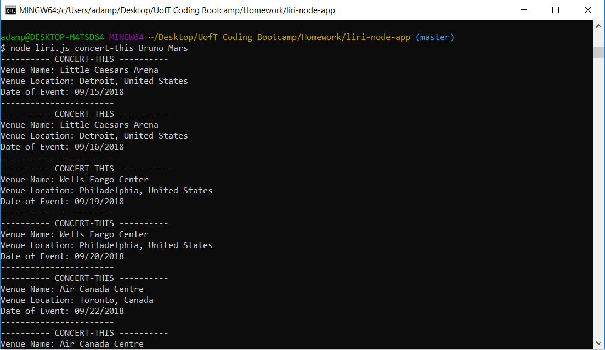

<h1>Liri Bot App</h1>
<h3>LIRI is a command line node app that takes in parameters and returns data based on one of four commands:
 
 
<ul>
<li>concert-this</li>
<li>spotify-this-song</li>
<li>movie-this</li>
<li>do-what-it-says</li>
</ul>
</h3>

<h2>Screenshot</h2>

<h2>Getting Started</h2>
<ul>
<li>Clone the repository to your computer</li>
<li>Run command 'npm install'</li>
<li>Run command 'node liri.js' or one of the commands above</li>
</ul>

<h2>What Each Command Does</h2>
<ol>
<strong><li>node liri.js concert-this 'artist/band name'</li></strong>
<ul>
<li>Shows the following information about the artist's/band's upcoming concerts in terminal/bash window:</li>
<ul>
<li>Name of the venue</li>
<li>Venue location</li>
<li>Date of event</li>
</ul>
</ul>
<strong><li>node liri.js spotify-this-song 'song name'</li></strong>
<ul>
<li>Shows the following information about the song in terminal/bash window:</li>
<ul>
<li>Artist(s)</li>
<li>The song's name</li>
<li>A preview link of the song from Spotify</li>
<li>The album that the song is from</li>
</ul>
</ul>
<strong><li>node liri.js movie-this 'movie name'</li></strong>
<ul>
<li>Shows the following information about the movie in terminal/bash window:</li>
<ul>
<li>Title of the movie</li>
<li>Year the movie came out</li>
<li>IMDB rating of the movie</li>
<li>Rotten Tomatoes rating of the movie</li>
<li>Country where the movie was produced</li>
<li>Language of the movie</li>
<li>Plot of the movie</li>
<li>Actors in the movie</li>
</ul>
</ul>
<strong><li>node liri.js do-what-it-says</li></strong>
<ul>
<li>It should run `spotify-this-song` for "I Want it That Way," as follows the text in `random.txt`</li>
</ul>
</ol>

<h3>Have fun!</h3>